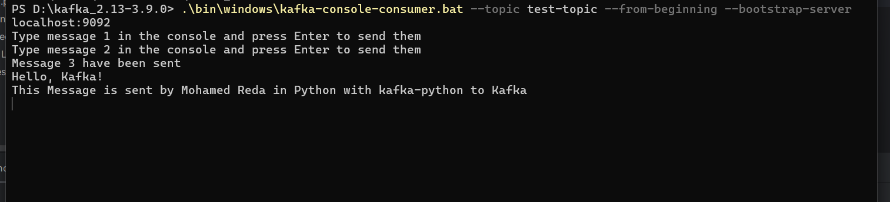
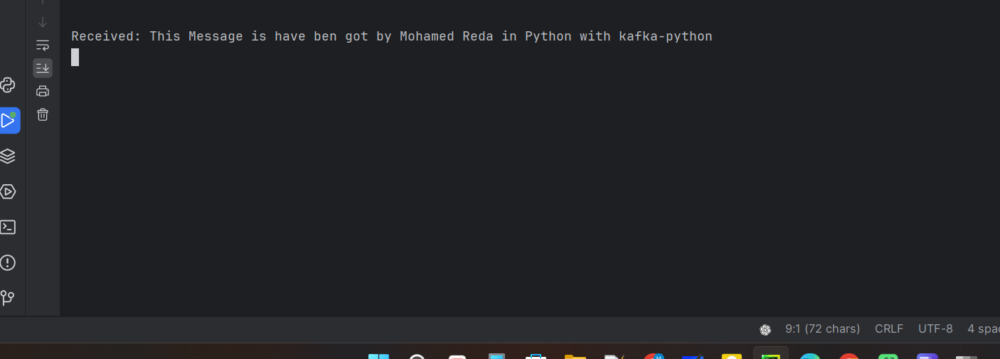
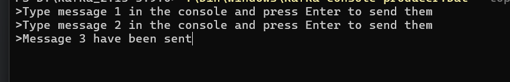
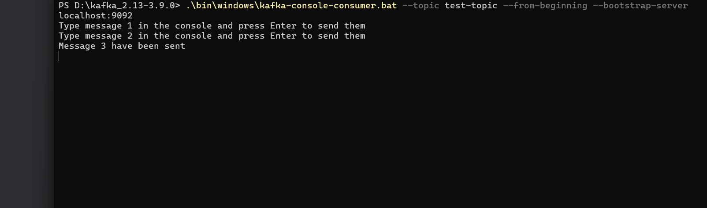

# Kafka and ZooKeeper Integration: Distributed Data Management for AI

This repository provides a **step-by-step guide** how to use **Apache Kafka** with **ZooKeeper** for distributed data management. Whether you're building real-time AI systems or experimenting with distributed data pipelines, this guide will help you get started.

## Table of Contents

1. [Screenshots](#screenshots)
2. [Prerequisites](#prerequisites)
3. [Step-by-Step Guide](#step-by-step-guide)
4. [Using Kafka with Python](#using-kafka-with-python)

---

# Screenshots:

### sending messages with Python producer:



### receiving messages with Python consumer:



### sending messages with CMD:



### receiving messages with CMD:



---

## Prerequisites

Before getting started, ensure you have the following installed:

- **Java Development Kit (JDK 11 or later)**: Kafka requires Java to run. Download it from [Oracle](https://www.oracle.com/java/technologies/javase-downloads.html) or [OpenJDK](https://openjdk.org/).
- **Kafka**: Download the latest Kafka binaries from the [official Apache Kafka website](https://kafka.apache.org/downloads).
- **Python (optional)**: If you want to use Kafka with Python, install the `kafka-python` library:
  ```bash
  pip install kafka-python
  ```

---

## Step-by-Step Guide

### 1. Download and Extract Kafka

- Download the Kafka binary (e.g., `kafka_2.13-3.9.0.tgz`) from the [official website](https://kafka.apache.org/downloads).
- Extract the `.tgz` file to a directory, e.g., `C:\kafka`.

### 2. Start ZooKeeper

ZooKeeper is required for traditional Kafka setups:

```bash
.\bin\windows\zookeeper-server-start.bat .\config\zookeeper.properties
```

### 3. Start Kafka Broker

Once ZooKeeper is running, start the Kafka broker:

```bash
.\bin\windows\kafka-server-start.bat .\config\server.properties
```

### 4. Create a Topic

Create a Kafka topic to send and receive messages:

```bash
.\bin\windows\kafka-topics.bat --create --topic test-topic --bootstrap-server localhost:9092 --partitions 1 --replication-factor 1
```

---

## Using Kafka with Python

**Run the Scripts**:

- Start the producer:
  ```bash 
  python producer_is_sending_message_to_Kafka_with_Python.py
  ```
- Start the consumer:
  ```bash
  python consumer_is_getting_message_to_Kafka_with_Python.py
  ```
